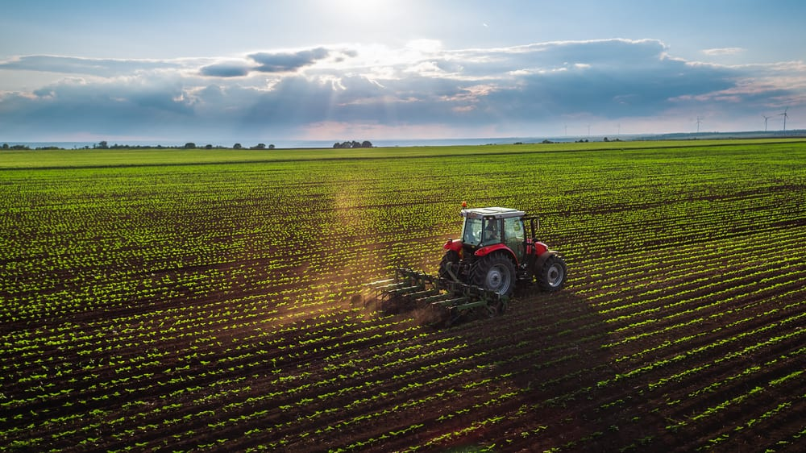

<style type="text/css">
h1.title {
  font-size: 27px;
  color: Black;
}
h4.author{
  color:Grey;
  margin-bottom: 40px;
}
h1.naslov{
  font-size: 50px;
  margin-bottom: 20px;
}
center.slika{
  margin-top: 20px;
  margin-bottom: 20px;
}
</style>

```{r setup, echo=FALSE, results='hide', message=FALSE, warning=FALSE}
# Če želimo nastaviti pisave v PDF-ju, odkomentiramo
# in sledimo navodilom v programu.
#source("fontconfig.r", encoding="UTF-8")
# Uvoz vseh potrebnih knjižnic
source("lib/libraries.r", encoding="UTF-8")
```

```{r rstudio, echo=FALSE, results='asis'}
# Izris povezave do RStudia na Binderju
source("lib/rstudio.r", encoding="UTF-8")
```

<center> <h1 class="naslov">EKOLOŠKO KMETOVANJE V SLOVENIJI</h1> </center>


Analizirala bom sektor kmetijstvo, kjer se bom osredotočila na ekološko usmerjene kmetije. Primerjala bom strukturo pridelkov ekoloških in neekoloških kmetij.

<center class="slika">





</center>

Prvo področje bo na splošno kmetijstvo. Najprej se bom osredotočila na to, katare regije v Sloveniji imajo največ kmetijskih gospodarstev. Nato si bom ogledala, če je zmeraj več kmetij z ekološkim kmetovanjem. To bi se zdelo logično, že zaradi dejstva, da je v trgovinah vedno več ekoloških izdelkov, torej je vedno več povpraševanja za takšne izdelke.
Ogledala si bom tudi kakšno razmerje živali-rastline je na slovenskih ketijah. Podrebneje bom analizirala strukturo živine. Primerjala bom strukturo živine iz ekološke reje in običajne reje.
Za konec si bom kot zanimivost pogledala, če obstaja povezava med ceno jajc in številom perutnine. Za to bom narisala črtni grafikon. Če bo iz grafa opazno, da sta črti podobne oblike, lahko sklepamo, da obstaja povezava.

**Cilj**: Predvidevam, da se število gospodarstev z ekološkim kmetovanjem skozi leta veča. Predvidevam tudi, da je struktura živine običajne reje različna od tiste iz ekološke reje, saj se večino ekoloških izdelkov povezanih z živino prodaja v obliki jajc in nekoliko manj mleka. Zato mislim, da bo velika večina živine iz ekološke reje perutnine. Za zadnji graf predvidevam, da bosta spremenljivki obratno sorazmerni, saj bi moral veljati zakon večja ponudba, manjše cene.

&nbsp;
&nbsp;

***

# Obdelava, uvoz in čiščenje podatkov

```{r uvoz, echo=FALSE, message=FALSE, warning=FALSE}
source("uvoz/uvoz.r", encoding="UTF-8")
```

Podatke o kmetijskih gospodarstvih v Sloveniji sem uvozila Eurostata v obliki csv. Podatke sem preoblikovala v obliko *tidy data*.

&nbsp;
&nbsp;

1. **Vrsta kmetijskih gospodarstev** - podatki o vrstah kmetijskih gospodarstev v Sloveniji
  - `Kmetijska gospodarstva` - spremenljivka: vrsta in namen kmetijskih gospodarstev,
  - `leto` - spremenljivka: vsebovana so leta 2000, 2003, 2005, 2007, 2010, 2013 ter 2016,
  - `stevilo` - meritev: število kmetijskih gospodarstev z določenim namenom v posameznem letu.
  
```{r Tabela1, echo=FALSE, message=FALSE}
kable(head(Tabela1), align="l")
```  
 
&nbsp;
&nbsp;

2. **Struktura rastlinskih pridelkov** - podatki o strukturi rastlinskih pridelkov na slovenskih kmetijah
  - `Rastlinski pridelki` - spremenljivka: vrsta rastlinskega pridelka,
  - `leto` - spremenljivka: vsebovana so leta 2000, 2003, 2005, 2007, 2010, 2013 ter 2016,
  - `stevilo` - meritev: število kilogramov rastlinskih pridelkov, pridelanih na slovenskih kmetijah v posameznem letu.
  
```{r Tabela2, echo=FALSE, message=FALSE}
kable(head(Tabela2), align="l")
```  
 
&nbsp;
&nbsp;

3. **Struktura živine** - podatki o strukturi živine na slovenskih kmetijah
  - `Zivina` - spremenljivka: vrsta živine,
  - `leto` - spremenljivka: vsebovana so leta 2000, 2003, 2005, 2007, 2010, 2013 ter 2016,
  - `stevilo` - meritev: število določene živine na slovenskih kmetijah v posameznem letu.
  
```{r Tabela3, echo=FALSE, message=FALSE}
kable(head(Tabela3), align="l")
```  
 
&nbsp;
&nbsp;

4. **Struktura ekoloških rastlinskih pridelkov** - podatki o strukturi ekoloških rastlinskih pridelkih na slovenskih kmetijah
  - `Ekoloski rastlinski pridelki` - spremenljivka: vrsta ekološkega rastlinskega pridelka,
  - `leto` - spremenljivka: vsebovana so leta med 2012 in 2017,
  - `stevilo` - meritev: število kilogramov ekoloških rastlinskih pridelkov, pridelanih na slovenskih kmetijah v posameznem letu.
  
```{r Tabela4, echo=FALSE, message=FALSE}
kable(head(Tabela4), align="l")
```  
 
&nbsp;
&nbsp;

5. **Struktura živine iz ekološke reje** - podatki o strukturi živine na slovenskih ekoloških kmetijah
  - `Zivina v ekoloski reji` - spremenljivka: vrsta živine iz ekološke reje,
  - `leto` - spremenljivka: vsebovana so leta med 2010 in 2017,
  - `stevilo` - meritev: število določene živine na slovenskih ekoloških kmetijah v posameznem letu.
  
```{r Tabela5, echo=FALSE, message=FALSE}
kable(head(Tabela5), align="l")
```  
 
&nbsp;
&nbsp;

6. **Kmetijska gospodarstva po statističnih regijah** - podatki o številu kmetijskih gospodarstev za posamezno regijo
  - `Kmetijska gospodarstva po statisticnih regijah` - spremenljivka: statistične regije Slovenije,
  - `leto` - spremenljivka: vsebovana so leta 2000, 2003, 2005, 2007, 2010, 2013 ter 2016,
  - `stevilo kmetijskih gospodarstev` - meritev: število kmetijskih gospodarstev v posameznem letu na določenem območju.
  
```{r Tabela6, echo=FALSE, message=FALSE}
kable(head(Tabela6), align="l")
```  
 
&nbsp;
&nbsp;

7. **Cene kmetijskih izdelkov** - podatki o povprečnih cenah za posamezne kmetijske izdelke
  - `Izdelek` - spremenljivka: vrsta kmetijskega izdelka,
  - `leto` - spremenljivka: vsebovana so leta 2000, 2003, 2005, 2007, 2010, 2013 ter 2016,
  - `povprecna cena` - meritev: povprecna cena kmetijskih izdelkov v posameznem letu.
  
```{r Tabela7, echo=FALSE, message=FALSE}
kable(head(Tabela7), align="l")
```  
 
&nbsp;
&nbsp;

***
# Analiza in vizualizacija podatkov

```{r vizualizacija, echo=FALSE, message=FALSE, warning=FALSE, results='hide'}
source("vizualizacija/vizualizacija.r", encoding = "UTF-8")
```
Najprej bom prikazala zemljevid Slovenije, ki prikazuje na katerih območjih je največ kmetijskih gospodarstev.

```{r zemljevid_slovenije, echo=FALSE, message=FALSE, fig.align='center', warning = FALSE, fig.width=14, fig.height=9}
print(zemljevid_slovenije)
```
Kot opazimo iz zemljevida je največ kmetij na podravskem, najmanj pa na zasavskem. To bi lahko sklepali iz dejstev, da je na tem področju najbolj rodovitna zemlja in geografsko najbolj primerna za pridelavo kmetijskih pridelkov.

Sedaj si poglejmo histogram, ki prikazuje gibanje kemtijskih gospodarstev z običajnim kmetovanjem in ekološkim kmetovanjem. Spremenljivka "kmetijska gospodarstva" predstavlja razliko med vsemi kmetijskimi gospodarstvi v Sloveniji in tistimi z ekološko usmerjenostjo.

```{r graf_rast_eko, echo=FALSE, message=FALSE, fig.align='center', warning = FALSE, fig.width=12, fig.height=7}
print(graf_rast_eko)
```

Iz histograma opazimo, da je z leti vedno več kmetijskih gospodarstev z ekološkim kmetovanjem in vedno manj z običajnim. To je verjetno posledica raziskav, ki prikazujejo, da neekološka pridelava rastlin in živali vpliva na zdravje človeka. Nastal je tudi globalni trend.

Sedaj si lahko ogledamo še strukturo kmetijskih gospodarstev v Sloveniji.

```{r graf_prid, echo=FALSE, message=FALSE, fig.align='center', warning = FALSE, fig.width=12, fig.height=7}
print(graf_prid)
```

Kot opazimo iz zgornjega grafa, je veliko več živine kot rastlinskih pridelkov. Opazimo tudi, da se število rastlinskih pridelkov skozi čas enakomerno zmanjšuje, med tem ko število živine precej niha. Ektremni padec je takoj opažen v letu 2005. To je morda posledica ptičje gripe, ki se je začela 2004 v Vietnamu in na Tajskem. Razlog je lahko tudi kriza v kmetijskem sektorju, ki je nastala zaradi vstopa v EU.

Bolj podrobno si oglejmo strukturo živine. Zanima me, če je ta enaka v običajni in ekološki reji.

```{r tortni_eko_ziv, echo=FALSE, message=FALSE, fig.align='center', warning = FALSE}
print(tortni_eko_ziv)
```

```{r tortni_ne_eko_ziv, echo=FALSE, message=FALSE, fig.align='center', warning = FALSE}
print(tortni_ne_eko_ziv)
```

Takoj je razvidno, da je struktura popolnoma drugačna. Pri živalih iz ekološke reje perutnina predstavlja kar 85%, medtem ko pri običajni reji le 54%. Torej se grafi usklajeni z mojim predvidevanjem.

Za konec si kot zanimivost lahko pogledamo še, ali obstaja kakšna povezava med številom kokoši in cene jajc.

```{r graf_kok, echo=FALSE, message=FALSE, fig.align='center', warning = FALSE, fig.width=12, fig.height=7}
print(graf_kok)
```

Kot vidimo iz grafa imata krivulji od leta 2005 dalje podobno obliko, torej na istih intervalih naraščata/padata. Sklepali bi lahko, da sta ti dve spremenljivki premo sorazmerni. Kar pa je drugačen rezultat, kot bi ga pričakovali, saj bi načeloma moralo držati pravilo, da večja kot je ponudba, manjša je cena. Zanimivo je tudi, da padec iz leta 2005 ni nič vplival na ceno jajc.

&nbsp;
&nbsp;

***
